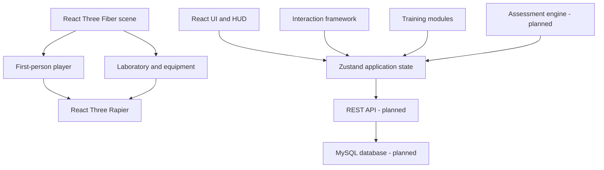

# TeleSim 3D Technical Design Specification

## Document Status

| Field | Value |
| --- | --- |
| Project | **TeleSim 3D: Interactive Telecom Training Application with Virtual Troubleshooting Scenarios** |
| Document type | Technical design specification |
| Current phase | Foundation prototype |
| Implementation language | JavaScript and JSX |
| Status convention | Features are identified as **Implemented**, **Partial**, or **Planned** |

## 1. Project Overview

TeleSim 3D is a browser-based telecom training prototype that places learners inside an interactive three-dimensional laboratory. The current application provides a navigable telecom room, representative furniture and networking equipment, first-person movement, physics-based collision, and the first reusable workstation interaction flow.

The project is being developed as a capstone-ready foundation for guided procedural training, assessment, and virtual troubleshooting. The present repository contains only a frontend prototype. It does not currently contain a backend service, database, authentication system, scoring engine, or complete training procedure.

## 2. Project Vision

The project vision is to provide an accessible virtual laboratory where students can safely practice telecom procedures and troubleshooting workflows before handling physical equipment. TeleSim 3D should complement laboratory instruction by offering repeatable scenarios, immediate guidance, measurable outcomes, and a consistent learning environment that can run on standard desktop browsers.

## 3. Target Users

- Students enrolled in telecommunications, networking, ICT, or related technical programs.
- Instructors who need a repeatable demonstration and assessment environment.
- Training institutions with limited access to physical telecom equipment.
- Entry-level technicians who need structured procedure review.

The current prototype supports the student exploration experience only. Instructor tools and account-specific experiences are planned.

## 4. Core Objectives

1. Represent a recognizable telecom laboratory in the browser.
2. Allow first-person exploration with familiar keyboard and mouse controls.
3. Prevent movement through room boundaries and major equipment.
4. Provide reusable proximity-based workstation interaction.
5. Guide learners through telecom procedures in ordered, verifiable steps.
6. Record mistakes, hints, completion time, and procedural accuracy in later phases.
7. Support troubleshooting scenarios that require diagnosis and validation.
8. Keep the codebase modular, beginner-readable, and suitable for academic review.

## 5. Current Technology Stack

| Technology | Current role | Status |
| --- | --- | --- |
| React 19 | Component-based user interface | Implemented |
| Vite 8 | Development server and production build | Implemented |
| JavaScript and JSX | Application source language | Implemented |
| Three.js | Core 3D rendering engine | Implemented through React Three Fiber |
| React Three Fiber | React renderer for the 3D scene | Implemented |
| Drei | Pointer-lock camera controls and R3F helpers | Implemented |
| React Three Rapier | Physics world, rigid body, capsule, and cuboid colliders | Implemented |
| Zustand | Interaction and training UI state | Implemented |
| React Router | Installed dependency | Not yet used by the application |
| ESLint | Static code validation | Implemented |

No backend framework, REST API, authentication provider, or database is implemented.

## 6. Current Implemented Features

### Laboratory Environment

- Full-screen responsive React Three Fiber canvas.
- Approximately 20 m × 20 m × 4 m enclosed laboratory.
- Gray floor, off-white walls, white ceiling, entrance door, side windows, and four ceiling fixtures.
- Ambient and directional lighting with shadows.

### Furniture and Equipment

- RJ45 and fiber workbenches.
- Two stools and a storage cabinet.
- Network rack containing router, switch, and patch-panel placeholders.
- Cable tester and low-poly RJ45 tool placeholders.
- Green and amber equipment indicator lights.

### Player and Physics

- First-person mouse look using pointer lock in supported top-level browser contexts.
- W, A, S, and D movement relative to the camera direction.
- Shift-based running.
- Dynamic capsule player body with gravity, damping, continuous collision detection, and locked rotation.
- Fixed cuboid colliders for the floor, four walls, both workbenches, both stools, network rack, and storage cabinet.
- No jumping.

### HUD and Interaction

- Centered crosshair.
- Movement instruction panel.
- Reusable horizontal proximity detector.
- RJ45 workbench interaction range of approximately 2.2 m.
- Bottom-center `Press E to interact` prompt when the player is near, pointer-locked, and not in training mode.
- Training overlay titled **RJ45 Cable Termination**.
- Begin Training and Exit actions.
- Current training content is limited to `Step 1: Inspect the tools on the workbench.`
- Escape closes the training overlay.

## 7. Planned System Architecture

The intended system is divided into independently testable layers:



Current implementation covers the frontend scene, player, physics, HUD, interaction framework, and minimal training state. Assessment, API, database, authentication, reporting, and multi-page navigation remain planned.

## 8. 3D Scene Architecture

`TelecomLabScene` owns the full-screen canvas, camera settings, lighting, environment, physics boundary, player, and React HUD overlays. `LabRoom` composes the visual room and fixed colliders.

The scene is separated by responsibility:

- `src/scenes/TelecomLab/` contains room composition and scene-specific assemblies.
- `src/objects/furniture/` contains reusable low-poly furniture.
- `src/objects/telecom/` contains reusable telecom equipment placeholders.
- `src/player/` contains player movement and keyboard input.
- `src/interaction/` contains reusable proximity and interaction UI logic.
- `src/store/` contains cross-component Zustand state.

Geometry is currently built from primitive boxes, cylinders, planes, and one small sphere. External models and textures are intentionally outside the current scope.

## 9. Player Controller Architecture

The current player uses one React Three Fiber camera and one dynamic Rapier rigid body. No duplicate camera is created, and the world is not moved to simulate player motion.

Key design details:

- Capsule dimensions: 0.5 m half-height and 0.35 m radius.
- Spawn body position: `[0, 0.85, 4]`.
- Approximate eye position at spawn: `[0, 1.65, 4]`.
- Walking speed: 3.5 m/s.
- Running speed: 6 m/s.
- Horizontal movement is calculated from the camera's forward and right vectors.
- Delta time controls movement response so acceleration is frame-rate independent.
- Vertical velocity remains controlled by Rapier gravity.
- Rotation is locked on the rigid body to prevent tipping.
- Player movement is disabled while training mode is active.
- Event listeners are installed and removed through React effects to remain safe under React Strict Mode.

## 10. Physics and Collider Strategy

The scene is wrapped in a Rapier `Physics` component with gravity set to `[0, -9.81, 0]`. Automatic colliders are disabled so the application can use intentional, lightweight collision volumes.

One fixed rigid body contains explicit cuboid colliders for:

- Floor.
- Four walls.
- RJ45 workbench.
- Fiber workbench.
- Two stools.
- Network rack.
- Storage cabinet.

The player uses an explicit capsule collider with friction, zero restitution, damping, and continuous collision detection. Visual meshes and colliders are kept separate so rendering detail does not unnecessarily increase physics complexity.

Future physics work should preserve this approach: use the simplest collider that accurately represents navigation boundaries, avoid collider duplication, and do not create dynamic rigid bodies for static decorative objects.

## 11. Interaction System Architecture

The current interaction system is proximity-based and deliberately does not use raycasting or 3D click handlers.

`Interactable` receives an identifier, label, world position, interaction distance, and child object. During each frame it calculates horizontal camera distance and updates Zustand only when the player crosses the range boundary. This avoids React state updates every frame.

`InteractionSystem`:

1. Shows the prompt only when an interactable is nearby, pointer lock is active, and training mode is closed.
2. Listens for a non-repeating `E` key press.
3. Releases pointer lock and enters training mode.
4. Handles Escape while training mode is open.
5. Renders the current training overlay.
6. Cleans up its keyboard listener when unmounted.

The RJ45 workbench is the only current interactable. Future interactables should reuse the same component and state contract.

## 12. Zustand State-Management Strategy

The current interaction store contains:

| State | Purpose |
| --- | --- |
| `nearbyInteractable` | Object currently within interaction range |
| `activeInteractable` | Object that opened the current training mode |
| `isPointerLocked` | Synchronizes pointer-lock state with HUD behavior |
| `isTrainingMode` | Switches between exploration and training UI |
| `trainingStarted` | Marks whether the current minimal training step has begun |

The store also exposes focused actions for pointer lock, nearby-object registration, training entry, training start, and training exit.

State-management rules for future work:

- Keep per-frame vectors, physics data, and transient mesh state out of Zustand.
- Use Zustand for state shared across the scene, HUD, and training UI.
- Use local React state for component-only presentation details.
- Update global state on meaningful transitions rather than every animation frame.
- Keep actions explicit so training transitions can be tested independently.

## 13. Training Module Lifecycle

### Current Lifecycle

1. **Explore:** Player moves through the laboratory.
2. **Available:** Player enters the RJ45 workbench's 2.2 m interaction range.
3. **Prompted:** Prompt appears while pointer lock is active.
4. **Opened:** `E` releases pointer lock and opens training mode.
5. **Started:** Begin Training sets `trainingStarted` to `true`.
6. **Step displayed:** The overlay displays the current single inspection instruction.
7. **Exited:** Exit or Escape clears the active training state and restores exploration availability.

### Planned Lifecycle

Future modules should use a configuration-driven lifecycle:

`idle → available → introduction → activeStep → validation → feedback → completed/failed → results → exit`

Every transition should define permitted actions, UI state, validation rules, and assessment events.

## 14. RJ45 Module Procedure States

Only the training shell and first inspection message are currently implemented. The following procedure state model is planned:

1. `introduction`
2. `inspectCableAndTools`
3. `stripOuterJacket`
4. `separateWirePairs`
5. `arrangeT568B`
6. `trimConductors`
7. `insertIntoConnector`
8. `crimpConnector`
9. `testCable`
10. `passResult` or `failResult`
11. `completed`

Each state should provide instructions, allowed actions, completion criteria, mistake conditions, hints, and the next valid transition. The system must not mark this procedure complete until the actions and validations exist.

## 15. Assessment and Scoring Architecture

Assessment is planned and not implemented. The future assessment layer should collect structured events rather than calculate scores directly inside 3D components.

Planned measures include:

- Completion time.
- Mistake count and mistake severity.
- Hint usage.
- Step order accuracy.
- Procedure accuracy.
- Cable test result.
- Final weighted score.

The assessment engine should receive training events, calculate a result from a documented rubric, and produce a serializable session record. Local progress saving is planned before server persistence. Results pages and instructor reports must be based on the same record format.

## 16. Planned Troubleshooting Scenario Architecture

Troubleshooting scenarios should be data-driven. A scenario definition should include:

- Scenario identifier and learning objective.
- Initial equipment state.
- Hidden fault or fault combination.
- Available diagnostic observations and tools.
- Valid repair actions.
- Evidence required for validation.
- Hint sequence.
- Success and failure conditions.
- Assessment weights.

Initial planned faults are loose cable, device power failure, incorrect IP configuration, disabled network port, and related repair-validation tasks. No troubleshooting engine is currently implemented.

## 17. Planned Frontend and Backend Architecture

### Frontend

The frontend will continue to use React, React Three Fiber, React Three Rapier, Zustand, and React Router. Planned page-level areas include sign-in, student dashboard, module selection, 3D training, results, and instructor reporting.

### Backend

A future REST API will provide authentication, module metadata, progress records, scores, and reports. The backend framework has not been selected and must not be assumed by frontend code.

### Database

MySQL is planned for user accounts, roles, training attempts, progress, assessment results, and report data. No schema or database connection currently exists.

## 18. Performance Requirements

- Target smooth interaction on current desktop browsers and typical academic laboratory computers.
- Aim for 60 frames per second on recommended hardware and avoid sustained drops below 30 frames per second.
- Keep primitive geometry and collider counts low.
- Avoid state updates and object allocation inside frame loops unless required.
- Reuse vectors, materials, geometry, and configuration where practical.
- Load future modules and large assets on demand.
- Compress and optimize any future models and textures.
- Track bundle growth; the current production build reports a non-blocking large-chunk warning after Three.js and Rapier are bundled.

## 19. Accessibility and Usability Requirements

- Provide clear control instructions before pointer lock begins.
- Keep Escape behavior predictable in both exploration and training modes.
- Maintain readable contrast for prompts, overlays, and buttons.
- Preserve keyboard access to training UI controls.
- Manage focus when opening and closing future modal experiences.
- Provide non-color-only indicators for important assessment feedback.
- Offer reduced-motion options before camera transitions or animated training effects are introduced.
- Document pointer-lock requirements and provide a clear recovery path.
- Investigate alternatives for users who cannot use mouse-look first-person navigation.

## 20. Security Requirements for Future Authentication

Authentication is not currently implemented. Future account work must:

- Hash passwords on the server with an established password-hashing algorithm.
- Never store plaintext passwords or secrets in frontend code.
- Use secure, HTTP-only cookies or another reviewed token strategy.
- Enforce authorization on the server for student and instructor operations.
- Validate and sanitize all API input.
- Protect against cross-site scripting, cross-site request forgery, injection, and insecure direct-object references.
- Apply rate limiting to authentication endpoints.
- Use HTTPS in deployed environments.
- Store secrets in environment configuration excluded from version control.
- Minimize personal data and define retention rules for student records.
- Record security-sensitive actions without logging credentials or tokens.

## 21. Browser Compatibility Requirements

- Primary target: current desktop versions of Chrome and Edge.
- Secondary target: current Firefox after manual pointer-lock and WebGL validation.
- Safari support requires separate testing and is not yet verified.
- Browsers must support WebGL and the Pointer Lock API for the full first-person experience.
- Pointer lock should run in a top-level permitted document; embedded preview environments may reject it.
- Mobile and touch-first controls are outside the current scope.
- Every release candidate should be manually tested at multiple desktop viewport sizes.

## 22. File and Folder Conventions

```text
src/
  assets/          Static images and future optimized 3D assets
  components/      Shared non-scene React components
  hooks/           Shared React hooks
  interaction/     Reusable interaction detection and UI coordination
  objects/
    furniture/     Reusable furniture meshes
    telecom/       Reusable telecom equipment meshes
  pages/           Future route-level pages
  player/          Player controller and input hooks
  scenes/
    TelecomLab/    Telecom laboratory composition
  store/           Zustand stores
  ui/              Future reusable HUD and interface components
  utils/           Pure helpers and configuration utilities
docs/              Project and engineering documentation
```

Use PascalCase for React component files, `use`-prefixed camelCase for hooks and Zustand stores, and descriptive scene-specific folders. Do not place application code in `node_modules`, `dist`, or `public`.

## 23. Git Workflow

1. Start work from an up-to-date main development branch.
2. Create focused branches such as `feature/rj45-steps`, `fix/player-collision`, or `docs/testing-checklist`.
3. Keep commits small and describe the completed change in imperative language.
4. Run lint, build, and relevant manual checks before requesting review.
5. Use pull requests for review and describe scope, screenshots, tests, and known limitations.
6. Do not commit generated dependencies, secrets, local environment files, or unrelated build artifacts.
7. Resolve review comments before merging.
8. Tag stable academic demonstrations or milestone releases.

## 24. Definition of Done

A feature is done only when:

- Its behavior matches an approved requirement.
- Current working behavior is not regressed.
- Components and state are placed in the appropriate folders.
- Event listeners and resources are cleaned up.
- Physics and interaction behavior are manually verified where relevant.
- Accessibility and error states have been considered.
- `npm run lint` passes.
- `npm run build` passes.
- The browser console has no feature-related errors.
- Documentation and tests are updated.
- No unfinished behavior is described as complete.

## 25. Known Technical Risks

- Pointer Lock behavior varies in embedded or restricted browser contexts.
- Three.js and Rapier substantially increase the production bundle size.
- Visual meshes and collider dimensions can drift if layout values are duplicated.
- Per-frame logic can reduce performance if future modules update React or Zustand state too frequently.
- Full training procedures may become difficult to maintain without configuration-driven state machines.
- Assessment results may become inconsistent if scoring rules are distributed across components.
- Future external models can increase memory use, load time, and asset-management complexity.
- Browser and GPU differences can affect lighting, shadows, and frame rate.
- Authentication and student-record features introduce privacy and security obligations.

## 26. Scope Limitations

The current prototype does not include:

- Complete RJ45 cable-termination simulation.
- Tool pickup, drag-and-drop, raycasting, outlines, or object animations.
- Jumping, crouching, gamepad controls, mobile controls, or accessibility alternatives for navigation.
- Assessment, scoring, timer, mistakes, hints, or results pages.
- Progress persistence.
- Troubleshooting logic.
- Routing-based application pages.
- Authentication, role management, backend API, or MySQL database.
- Instructor dashboards or reports.
- External 3D models, production textures, sound design, or localization.

## 27. Future Expansion Plans

- Complete the RJ45 cable-termination procedure and validation states.
- Add workstation focus mode and guided camera transitions.
- Add assessment, results, and local progress persistence.
- Implement troubleshooting scenarios and diagnostic tools.
- Add student and instructor accounts backed by a REST API and MySQL.
- Add instructor reports and progress review.
- Add copper splicing, fiber preparation, fiber fusion splicing, and router/switch configuration modules.
- Introduce optimized models, textures, audio, localization, and accessibility settings after the core training architecture is stable.
- Evaluate offline support, learning-management-system integration, and analytics after privacy and deployment requirements are defined.
